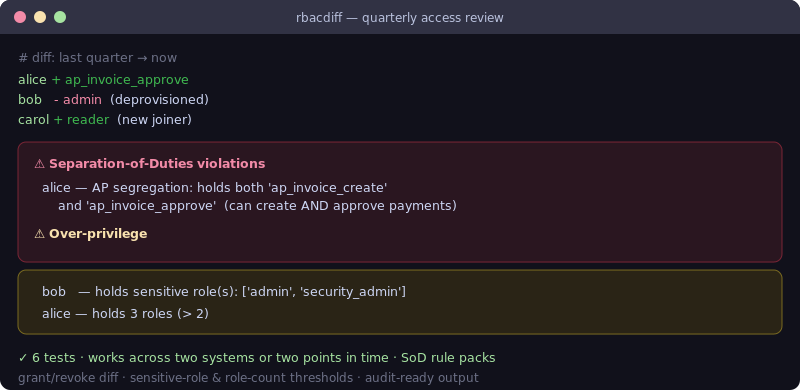

# rbac-diff

[](https://github.com/JCreatesGH/rbac-diff/actions)
[](https://www.python.org/)
[](LICENSE)

Run an access review with evidence. `rbacdiff` compares two RBAC snapshots — across systems or across time — and flags **over-privilege** and **separation-of-duties** violations. Perfect for quarterly access certifications and SOX/ISO audits.



## Install

```bash
pip install rbacdiff
```

## Use it

```python
from rbacdiff import load_snapshot, diff_snapshots, sod_violations, over_privileged, SodRule

before = load_snapshot(last_quarter)     # {user: [roles]}
after = load_snapshot(current)

for c in diff_snapshots(before, after):
    print(c.user, "granted", c.granted, "revoked", c.revoked)

rules = [SodRule("AP segregation", "ap_invoice_create", "ap_invoice_approve")]
sod_violations(after, rules)             # users who can create AND approve

over_privileged(after, sensitive_roles={"admin", "security_admin"}, max_roles=10)

from rbacdiff import risky_grants
risky_grants(diff_snapshots(before, after), {"admin"})   # who was *newly* granted admin
```

## CLI

Installing the package adds an `rbacdiff` command for access reviews in CI (exits 1 on any risk):

```bash
$ rbacdiff before.json after.json --sensitive admin,security_admin
$ rbacdiff before.json after.json --sod sod-rules.json --json
$ rbacdiff before.json after.json --max-roles 10
```

## What it finds

- **Grant/revoke diff** — exactly which roles each user gained or lost between snapshots (including new and removed users).
- **SoD violations** — users holding both halves of a conflicting role pair (e.g. create + approve), via configurable `SodRule` packs.
- **Over-privilege** — users holding sensitive roles, or more than a threshold number of roles.
- **Risky grants** — from the diff, the users who were *newly* granted a sensitive role (the headline access-review signal).

Snapshots are just `{user: [roles]}`, so it works with ServiceNow, Active Directory, cloud IAM exports, or anything you can dump to JSON.

## Development

```bash
pip install -e .[dev] && python -m pytest -q   # 11 tests
```

## License

MIT
